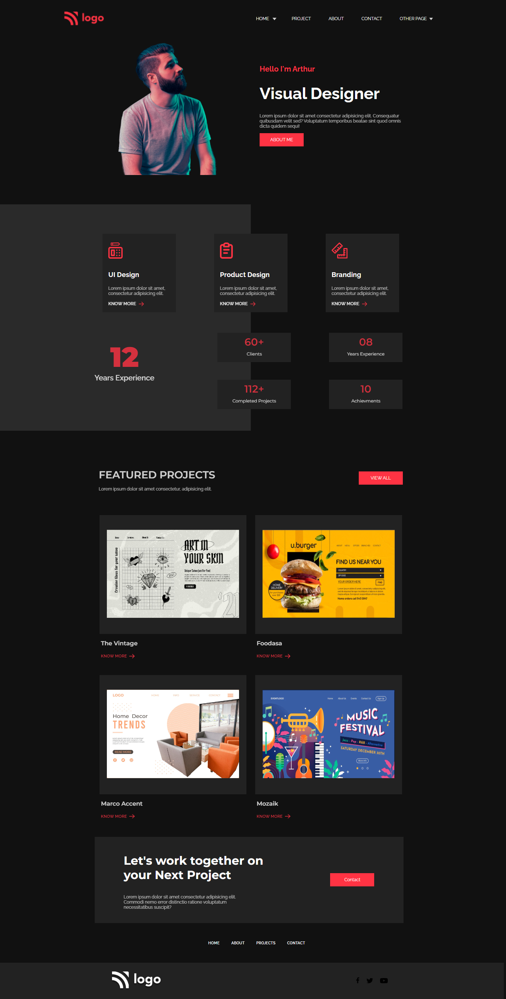

# Project-15
Visual Designer Portfolio Home Page

Creating a Portfolio webpage for a Visual Designer

Hands-on Experience:
- Flexbox - 'Extensive Usage'
  - Display type
  - Justify content
  - Flex direction
- Creating cards
  - Box shadow
  - Background color
- SVG files Handling
  - Working on Figma
- Background Styling
- Pseudo selectors
  - Hover
- Transitions
  - Delay
  - Ease-in, Ease-out

  

